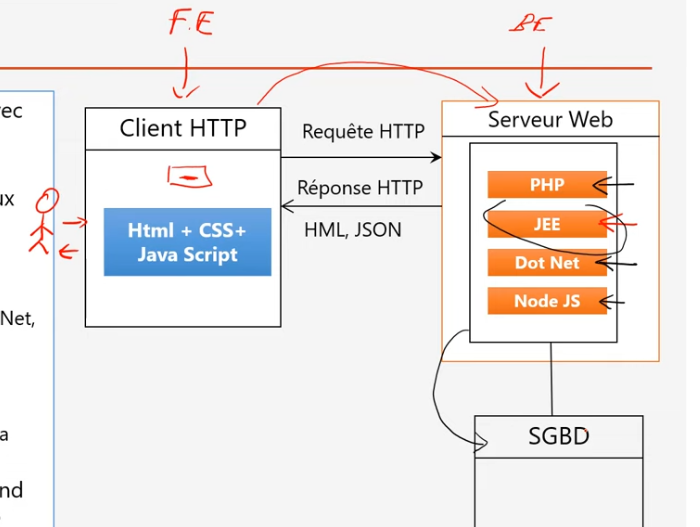
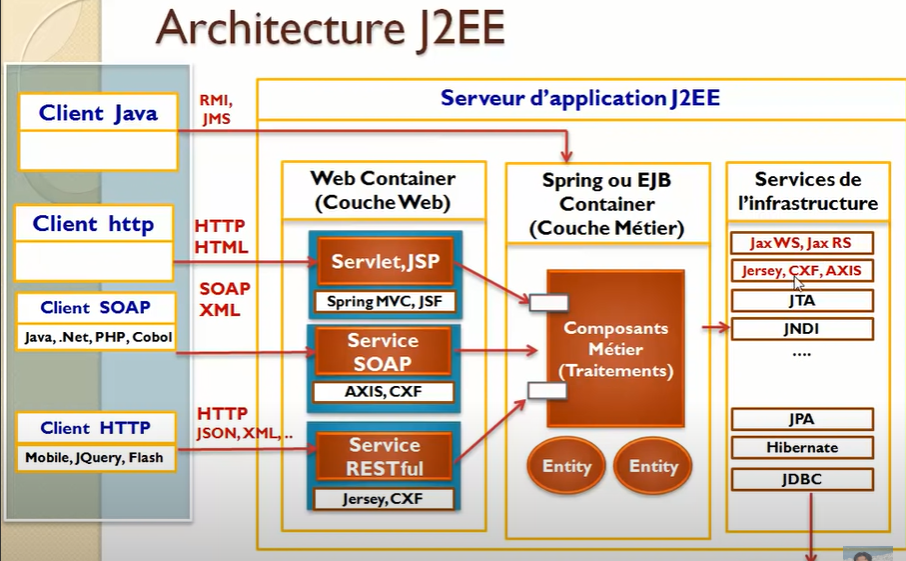

## Maitriser Spring Framework with Yousfi

# Architecture web

<p align="center">
    
</p>

 > Backend

    php -f  lavarel, symphony,...
    JEE  -f spring, EJB ( derriere y'a d'autres frameworks comme hibernate,spring security,..)
    Dot Net -f  asp.net,Entity Framework
    Node Js -f express, Next js
    Python -f Django,Flask, ...


 > Frontend

    javascript -f  Angular, React, Vuejs...
    Html
    Css -f bootstrap, Tailwind


# pourquoi utilisé les frameworks?

```

Developer des applications respectants les bonnes pratiques, de bon qualité avec un temps réduit.
Les frameworks s'ocuppe des bésoins techniques et le developpeur le besoin fonctionnel. -p  IOC


```

# Single thread non bloquante & Multi thread Bloquantes


# Serveurs & hébergement

```
> pulseHeberg

```


## JEE
```
une architecture qui offre un ensemble de framework pour developper des applications

```

>IOC

```
le technique pour le framework 

JEE -f Spring
il permet d'integrer les autres frameworks hibernates,..

JEE -f EJB  conteneur lourd(...)

```

> AOP

```
```

## Serveur d'applications
<br>
<p align="center">
    
</p>

```
Serveur Application = Contneur web + spring ou EJB conteneur (framework) + services de l'infrastructure (ensembles de frameworks,...)

 Le serveur d'applications contient des conteneurs Web, EJB et un serveur Web en tant que partie intégrée.

 expose la partie metier d'une application generalement sous forme d'API.

 JBOSS, Web Sphere
 ** Tomcat ( conteneur web combiné spring pour formé un serveur d'application )

```

> App = Serveur d'app + Frameworl IOC  + Frameworrk Mapping OR( Hibernate ) +  Framework web (Spring MVC, JSF,) + ...
