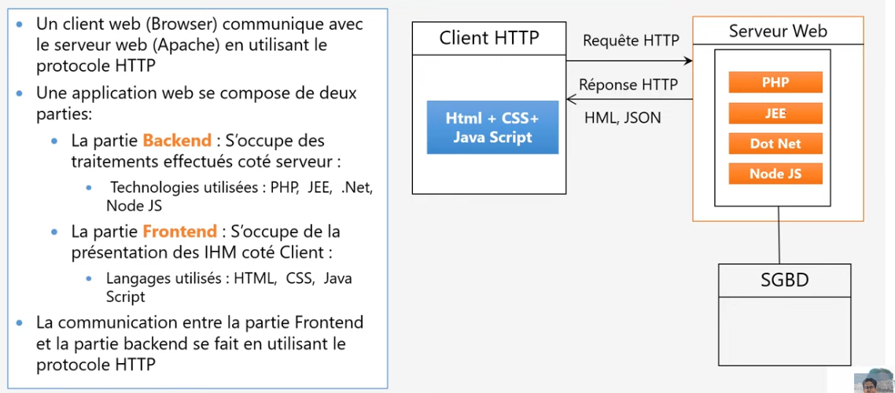

## Maitriser Spring Framework with Yousfi

# Architecture web

<p align="center">
    
</p>

 > Backend

    php -f  lavarel, symphony,...
    JEE  -f spring ( derriere y'a d'autres frameworks comme hibernate,spring security,..)
    Dot Net -f  asp.net,Entity Framework
    Node Js -f express, Next js
    Python -f Django,Flask, ...


 > Frontend

    javascript -f  Angular, React, Vuejs...
    Html
    Css


# pourquoi utilisé les framework?

```
Developer des applications respectants les bonnes pratiques, de bon qualité avec un temps réduit.

```

