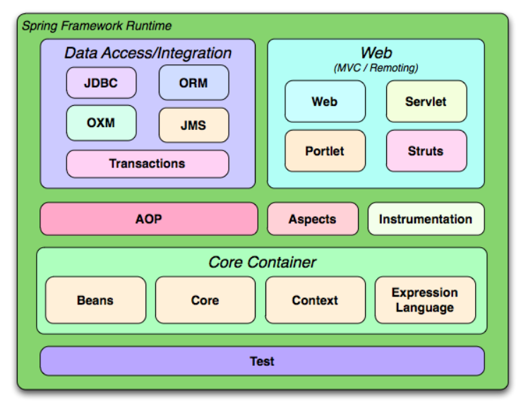

# Spring Framework 

<p align="center">
    
</p>

<br>

```
Spring Framework is a Java platform that provides comprehensive infrastructure support for developing Java applications. Spring handles the infrastructure so you can focus on your application.

```
